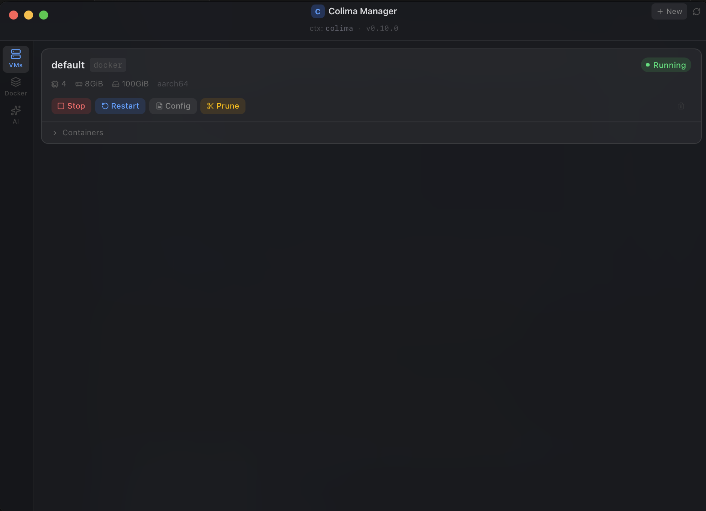

<p align="center">
  
</p>

<h1 align="center">Colima Manager</h1>

<p align="center">
  A lightweight macOS menu bar app for managing <a href="https://github.com/abiosoft/colima">Colima</a> virtual machines, Docker containers, and AI models — without touching the terminal.
</p>

---



---

## Features

- **VM Management** — Start, stop, restart, and delete Colima instances with one click
- **Live resource monitoring** — Real-time CPU, memory, and disk usage for running VMs
- **Container management** — View, start, stop, pause, restart, exec, and inspect containers
- **Container stats** — Per-container CPU, memory, and network I/O
- **Image management** — List, pull, remove, and prune Docker images
- **Volume management** — List, remove, and prune Docker volumes
- **Docker Desktop support** — View and manage containers from non-Colima Docker contexts (e.g. `desktop-linux`)
- **AI Models tab** — Run, serve, pull, and list models with Docker Model Runner (0.10.1+) or krunkit
- **Quick tray actions** — Start, stop, and restart instances directly from the menu bar
- **In-app auto-updates** — Download and install new versions directly from the app (signed builds)
- **Settings** — Configurable default VM presets, auto-hide, notifications
- **Log drawer** — Streams real-time output for any long-running command
- **Config viewer** — Inspect a profile's `colima.yaml` without leaving the app
- **Onboarding** — Detects if Colima isn't installed and shows step-by-step setup instructions

---

## Requirements

- macOS (Apple Silicon recommended for AI model support)
- [Colima](https://github.com/abiosoft/colima) — `brew install colima`
- [Docker](https://docs.docker.com/engine/install/) — `brew install docker`

### Optional: AI model support

**Colima 0.10.1+** (recommended): Uses [Docker Model Runner](https://docs.docker.com/model-runner/) — works with any VM type, no extra setup needed. Just open the **AI** tab and run a model.

**Colima < 0.10.1**: Requires Apple Silicon + macOS 13+ and krunkit for GPU access:

```sh
brew tap slp/krunkit
brew install krunkit
```

Then use the **AI** tab → **Setup** to get started.

---

## Installation

### Download (recommended)

1. Go to the [latest release](https://github.com/thedonmon/colima-tauri-ui/releases/latest)
2. Download the `.dmg` file
3. Drag **Colima Manager** to your Applications folder

> **Note:** The app is not notarized with Apple (I'm not paying $99/yr for a developer account). macOS will quarantine it on first install. Run this once:
> ```sh
> xattr -cr "/Applications/Colima Manager.app"
> ```
> This is a **one-time step**. After that, all future updates are delivered and installed automatically through the in-app updater (Settings → Check for updates). Update builds are signed and verified, and you'll see [release notes](https://github.com/thedonmon/colima-tauri-ui/releases) before installing.

### Build from source

```sh
git clone https://github.com/thedonmon/colima-tauri-ui.git
cd colima-tauri-ui
npm install
npm run tauri build
```

The built app will be at `src-tauri/target/release/bundle/macos/Colima Manager.app`. Copy it to `/Applications`.

---

## Getting Started

### Install Colima

```sh
brew install colima
brew install docker
```

### Start your first VM

You can start a VM from the app or from the terminal:

```sh
# Default (VZ, Docker runtime)
colima start

# With custom resources
colima start --cpu 4 --memory 8 --disk 100

# With krunkit for AI/GPU support
colima start --runtime docker --vm-type krunkit
```

---

## Development

Built with [Tauri v2](https://tauri.app), [React 19](https://react.dev), [TypeScript](https://www.typescriptlang.org), and [Tailwind CSS v4](https://tailwindcss.com).

### Prerequisites

- [Rust](https://rustup.rs)
- [Node.js](https://nodejs.org) 18+
- Xcode Command Line Tools

### Run in dev mode

```sh
npm install
npm run tauri dev
```

### Build

```sh
npm run tauri build
```

---

## Tech Stack

| Layer | Technology |
|---|---|
| Shell | Tauri v2 (Rust) |
| UI | React 19 + TypeScript |
| Styling | Tailwind CSS v4 |
| State | Zustand |
| Icons | Lucide React |

---

## Notes

- Colima profiles map to Docker contexts: `default` → `colima`, `myprofile` → `colima-myprofile`
- The log drawer streams stdout/stderr in real time via Tauri events
- Container exec opens a new Terminal.app window with an interactive shell
